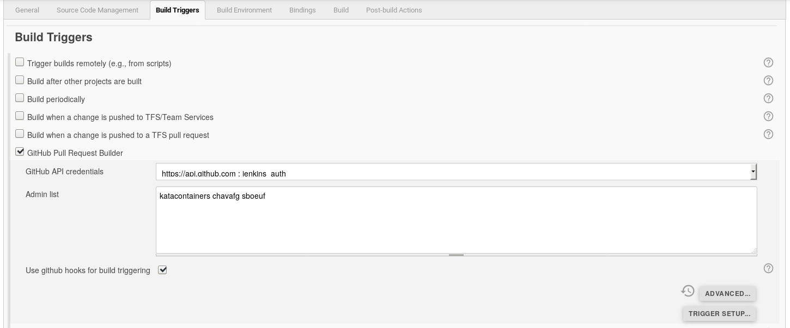
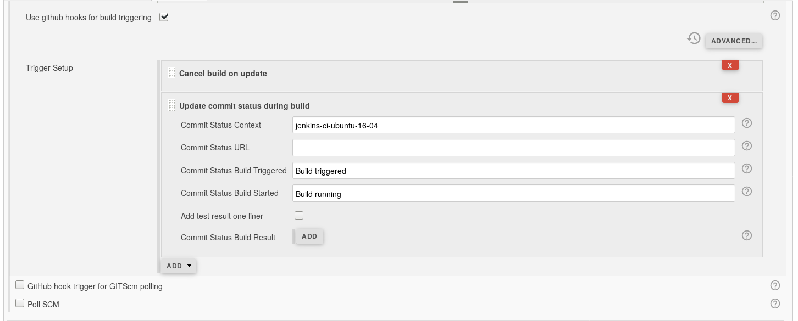
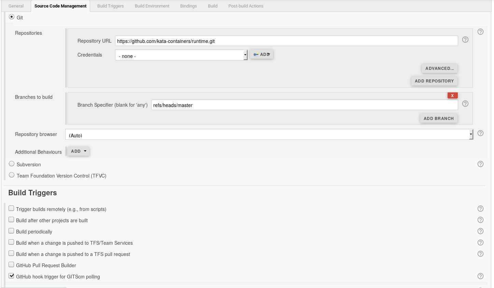
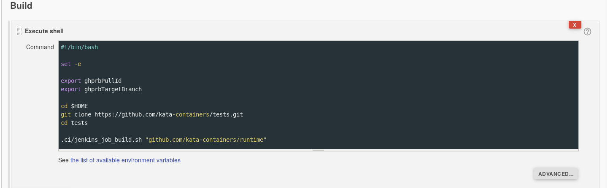
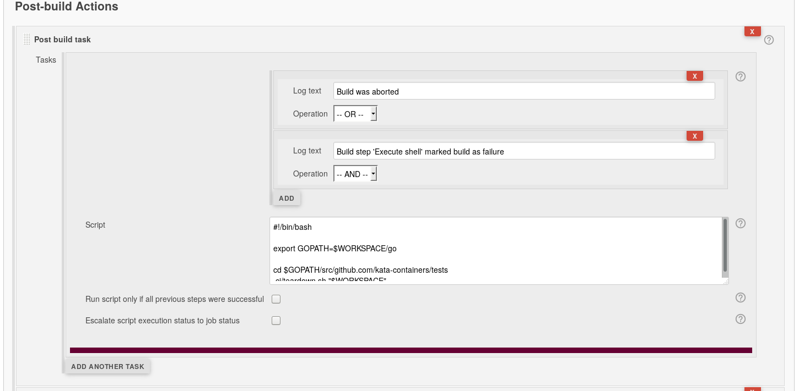

* [Kata Containers Jenkins CI setup](#kata-containers-jenkins-ci-setup)
   * [Types of jobs](#types-of-jobs)
      * [PR builds](#pr-builds)
      * [Master builds](#master-builds)
      * [GitHub bandwidth and tokens](#github-bandwidth-and-tokens)
   * [Job build script](#job-build-script)
   * [Setting up Jenkins](#setting-up-jenkins)
      * [Naming jobs](#naming-jobs)
      * [Setting up the scripts](#setting-up-the-scripts)
   * [Environment variables](#environment-variables)
      * [Input variables](#input-variables)
      * [Output variables](#output-variables)
   * [Experienced users](#experienced-users)
   * [Other CIs](#other-cis)

# Kata Containers Jenkins CI setup

This document is an overview of how Kata Containers integrates with [Jenkins](https://jenkins.io/).
It also directs you to configuration information and scripts to help you set up a
Kata Containers Jenkins CI system.

## Types of jobs

The Kata Containers Jenkins CI system uses Jenkins 'Freestyle Project' build jobs
to perform its builds. Kata Containers CI operates two types of CI builds:

- [PR builds](#pr-builds)
Builds are scheduled upon submission or change to a Pull Request on any of the repositories.

- [Master builds](#master-builds)
A build is scheduled upon the merge of a Pull Request into the master branch of a repository.

How these builds are configured and executed are subtly different:

### PR builds

PR builds are triggered from Jenkins using the [GitHub Pull Request Builder](https://plugins.jenkins.io/ghprb) (GHPRB)
plugin.

The GHPRB plugin is configured to trigger through GitHub hooks. This is the preferred method
to trigger on changes (more efficient than polling). Kata Containers integrates the CIs
using the [katacontainersbot](https://github.com/katacontainersbot) user. Please discuss
your requirements with the Kata Containers team who will then make the appropriate changes.

Set the GHPRB triggers similar to the following:


Set the GHPRB `Trigger Setup` further options similar to the following:


### Master builds

Master branch builds are tracked with the Jenkins [git Source Code Management](https://plugins.jenkins.io/git)
(GITScm) plugin. GITScm GitHub hooks are used to trigger builds.

The Jenkins setup should look similar to the following for the:

- Repository URL setup
- Branches to build
- Hook trigger enablement




### GitHub bandwidth and tokens

Note that the GitHub API access is [rate limited](https://developer.github.com/v3/#rate-limiting). If no GitHub access authentication method is configured into Jenkins
then the CI might quickly run out of GitHub access bandwidth. This will stall the CI.

For Kata Containers CI we configure Jenkins with a GitHub [Personal API token](https://blog.github.com/2013-05-16-personal-api-tokens/), which increases the bandwidth capacity.

## Job build script

Kata Containers Jenkins builds, for both PR and Master builds, are invoked using the top
level [`jenkins_job_build.sh`](https://github.com/kata-containers/tests/blob/master/.ci/jenkins_job_build.sh) script from the [katacontainers/tests](https://github.com/kata-containers/tests)
repository.

This script takes a single argument (i.e. the path to the repository to build), and utilizes
some environment variables to guide what sort of build and run it will perform.

An example of how this script is invoked from Jenkins is shown in the [Setting up Jenkins](#setting-up-jenkins) section.

## Setting up Jenkins

### Installing Plugins

Kata Containers Jenkins CI relies on some specific Jenkins Plugins. Notably, if you wish
to configure PR builds you will most likely wish to install the 
[GitHub Pull Request Builder](https://plugins.jenkins.io/ghprb) plugin in order to trigger
builds from the Kata Containers GitHub repositories.

### Naming jobs

Generally the jobs in Jenkins are named in the form `kata-containers-<repo>-<distro>-<buildtype>`.
For example, for a runtime repo PR build on Ubuntu 17.10, the Job is called:
`kata-containers-runtime-ubuntu-17-10-PR`. Following this naming convention makes it much
easier for other members of the project to navigate all CIs in a similar manner.

### Setting up the scripts

Both PR and Master builds use the same form of build and post-build teardown scripts that
are configured in the Jenkins Job UI. These scripts look like:

Build execute shell:
```bash
#!/bin/bash

set -e

export ghprbPullId
export ghprbTargetBranch

cd $HOME
git clone https://github.com/kata-containers/tests.git
cd tests

.ci/jenkins_job_build.sh "github.com/kata-containers/runtime"
```
> **Note:**
>
> The `export` of the `ghprb` variables for the Master builds is benign, as the Master
> builds do not use the GHPRB plugin. Subsequently, the `jenkins_job_build.sh` script can
> still test for the GHPRB variables to distinguish between a PR and Master build.

This script is placed into the Jenkins build dialog like:



Teardown script:

```bash
#!/bin/bash

export GOPATH=$WORKSPACE/go

cd $GOPATH/src/github.com/kata-containers/tests
.ci/teardown.sh "$WORKSPACE"
```

The teardown script is entered into the Jenkins Post-Build Actions dialog like:



## Environment variables

The `jenkins_job_build.sh` script both checks for some variables to decide what to do,
and sets some variables for sub-scripts to check.

### Input variables

The following variables influence the actions of the script:

| Var                 | Effect                                                           |
| ---------           | ---------------------------------------------------------------- |
| `ghprbPullId`       | Is used in PR builds to locate the correct branch on GitHub to pull and build. |
| `ghprbTargetBranch` | Is set by the GHPRB Jenkins plugin. Is only set for PR builds, and is used with `ghprbPullId` to distinguish between PR and Master builds. |
| `KATA_DEV_MODE`     | Must not be set, or the script will not act as a CI script. `KATA_DEV_MODE` is a developer only option allowing the script to be run 'safely' in a development environment. |
| `METRICS_CI`        | If set, will skip running the QA tests after the install/build phases (as the tests are not required for a metrics run). |
| `WORKSPACE`         | Must be set. Is set by Jenkins to point at the directory the script will use as its workspace (scratch area) |

### Output variables

| Var                 | Effect                                                           |
| ---------           | ---------------------------------------------------------------- |
| `CI`                | Is set by the script (unless `KATA_DEV_MODE` is already set) to indicate to sub-scripts that this is a CI build. |
| `GOPATH`            | Is set to the installed Go environment                           |
| `GOROOT`            | Is set to the installed Go environment                           |
| `kata_repo`         | Is set to the GitHub repo name, as passed in to $1 of the script. |
| `PATH`              | Is modified to include `${GOPATH}/bin`, `/usr/local/go/bin` and the `[*]sbin` directories. |

## Experienced users

For the more experienced Jenkins user, if you are comfortable reading Jenkins XML config files
then you can find a backup of our Azure based Jenkins QA CI in this repository under the
[jenkins sub folder](https://github.com/kata-containers/ci/tree/master/jenkins).

## Other CIs

Formerly Kata Containers, and one of its predecessors [Clear Containers](https://github.com/clearcontainers)
used both [Travis](https://travis-ci.com/) and [SemaphoreCI](https://semaphoreci.com/)
as part of their CI infrastructure. Kata Containers is phasing use of these out in current
preference for Jenkins, but if you have a strict need to use either of those CI systems with
Kata Containers then feel free to ask the Kata Containers team for any relevant guidance.
