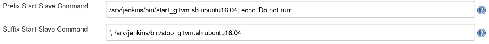
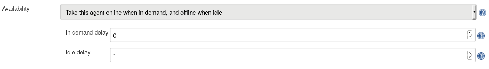

# Kata Containers metrics Jenkins CI VMs

* [Background](#background)
* [Overview](#overview)
* [Pre-requisites](#pre-requisites)
* [The scripts](#the-scripts)
    * [`1_create_keys.sh`](#1-create-keys-sh)
    * [`2_build_baseimage.sh config_dir`](#2-build-baseimage-sh-config-dir)
    * [`3_complete_baseimage.sh config_dir`](#3-complete-baseimage-sh-config-dir)
    * [`4_clone_vm.sh config_dir`](#4-clone-vm-sh-config-dir)
    * [`5_login_clone.sh config_dir`](#5-login-clone-sh-config-dir)
    * [`6_start_clone_agent.sh config_dir`](#6-start-clone-agent-sh-config-dir)
    * [`7_delete_clone.sh config_dir`](#7-delete-clone-sh-config-dir)
* [Example](#example)
* [Configuring the user on the host](#configuring-the-user-on-the-host)
    * [Add GOLANG `bin` directories to path](#add-golang-bin-directories-to-path)
    * [Add user to VM groups](#add-user-to-vm-groups)
    * [Installing the `agent.jar`](#installing-the-agent-jar)
    * [Setup Jenkins SSH keypair login](#setup-jenkins-ssh-keypair-login)
* [Configuring Jenkins](#configuring-jenkins)
    * [Setup the pre-post scripts](#setup-the-pre-post-scripts)
    * [Set up the short lived nodes](#set-up-the-short-lived-nodes)
* [Node specific modifications](#node-specific-modifications)
    * [Proxies](#proxies)
    * [Tuning `checkmetrics.toml`](#tuning-checkmetrics-toml)

This directory contains a set of configuration files and helper scripts
to aid in setting up a [Jenkins](https://jenkins.io/) CI system to run
the [Kata Containers metrics tests](https://github.com/kata-containers/tests/tree/master/metrics)
inside Virtual Machines (VMs).

## Background

Ideally the metrics are run on bare metal machines, in order to achieve the most
repeatable results. However, occasionally a Pull Request can have unwanted side effects
that then require the server to be rebooted, partially reconfigured, or re-installed.
Sometimes such a workflow is not practical. In that situation the Pull Request metrics
runs can be isolated from the bare metal machine by executing a "clean" Virtual Machine
on the system for each Pull Request.

The downside is that running inside a VM will likely introduce more "noise" into the
test results.

## Overview

The scripts in this directory help construct a Virtual Machine (QEMU qcow2) image
suitable for running the metrics tests. The scripts are based around the use of
[libvirt](https://libvirt.org/) and the [`virsh`](https://libvirt.org/virshcmdref.html) tool.

Briefly, the scripts do the following:
- Create an RSA keypair for SSH interaction between the host machine and the VMs.
- Build a master VM image using `virt-install` and [cloud-init](https://cloudinit.readthedocs.io/en/latest/#).
- Install all components needed for the metrics run into the VM image.
- Enable the master image to be cloned:
  - to ensure a "clean" environment for each PR run.
  - to preserve the master image from any corruption by a PR run.
- Provide scripts for use from Jenkins to launch a cloned VM with a Jenkins agent and to
delete a cloned VM.

## Pre-requisites

The scripts in this directory rely upon certain tools being available on the host
system. The following lists those tools, and the Ubuntu packages or alternative
installation methods that can be used to install them. Package names may be
different for other distributions.

| Dependency | Ubuntu package or method |
| ----------- | ------------------------ |
| `go` | Install latest from [golang.org](https://golang.org) |
| `jre` | package `default-jre` |
| `libvirt` | package `libvirt-bin` |
| `qemu-kvm` | package `qemu-kvm` |
| `virtinst` | package `virtinst` |
| `yq` | Install latest with `go get` from [`mikefarah/yq`](https://github.com/mikefarah/yq)|

## The scripts

The scripts are numbered roughly in the order you might expect to run them.
Some scripts might only be required to be run once for initialization.
Some scripts might be required to recover or debug a master image.
Some scripts are helpers for diagnostics and debug.
Some scripts are designed to be invoked by Jenkins or a Jenkins helper script.

The majority of scripts require a single `config dir` argument so they can locate
information about the VM setup or VM machine names. This enables the use of
multiple configuration directories to enable VMs of different
configuration setups (such as different distributions).

### `1_create_keys.sh`

This script creates an RSA key pair using `ssh-keygen`. This key pair is used to
`ssh` between the host system and the VMs.

By default a single keypair is used for all VMs. You should not have to re-generate
the keypair unless you accidentally delete them or have some other issue.

If you re-generate the keypair you will need to re-generate or patch any existing
VMs to use the new keys.

### `2_build_baseimage.sh config_dir`

This is the main master VM creation script. It uses `virt-install` along with
the `cloud-init` files found from the `config_dir` config files.

`cloud-init` runs in the VM, parallel with the first VM boot. You might see a
login prompt appear at the VM, but initialization is *not* complete until
you see a `cloud-init` line similar to:

```
[  123.456789] cloud-init[1234]: Cloud-init v. 18.2 finished at Tue, 29 May 2018 15:42:43 +000
```

At this point detach from the VM shell by pressing `^]` three times. This should drop you
back to your host system, but leaves the VM running for the next step.

### `3_complete_baseimage.sh config_dir`

This step completes the installation of the master VM by copying the final few files over
and then shutting the master VM down.

At this point the master VM is fully initialized and shut down and you should not
need to modify the master VM for this configuration further.

### `4_clone_vm.sh config_dir`

This script is mainly for testing or for invocation by the CI system. It clones the
master VM image in readiness to run it.

### `5_login_clone.sh config_dir`

This script is mainly for testing. It runs a VM clone (which should have been created with `4_clone_vm.sh`), and `ssh`'s into it.

### `6_start_clone_agent.sh config_dir`

This script is designed to be launched by Jenkins. It clones and runs a VM from the
master image, copies the Jenkins `agent.jar` file across to the image, and executes the
agent over SSH. See the section on [configuring Jenkins](#configuring-jenkins) for
details on how to integrate this script into the Jenkins config.

> **Note:** This script is written to avoid generating or consuming data from the
> invoking terminal - Jenkins expects to communicate solely with the `agent.jar`. Other
> extraneous data generation or consumption can make the agent connection fail.

To aid with any potential debug, the majority of the code is invoked from a `main()`
function that has its input/output redirected to `/dev/null`. To debug, remove this
indirection, but *do not* expect the `agent.jar` to connect to Jenkins successfully.

### `7_delete_clone.sh config_dir`

This script will shut down and remove a clone VM and its relevant storage items.
This script is expected to be invoked either by Jenkins upon agent disconnect, or
by hand if testing VMs.

## Example

```bash
# Run this once ever normally, unless you need to renew your keys.
$ ./1_create_keys.sh
# Now start to build the master VM image.
$ ./2_build_baseimage.sh ubuntu16.04
# And wait for the cloud-init 'finished' line.
# Now press ^]^]^] to get back to the host, and leave the master VM running.
# And complete the master VM initialization.
$ ./3_complete_baseimage.sh ubuntu16.04
# At this point you have a master VM image installed, which you can view with virsh:
$ virsh list --all
 Id    Name                           State
----------------------------------------------------
 -     ubnt16.04_master               shut off

# If you wish to hand-debug a VM at this point, then you might also want to:
$ ./4_clone_vm.sh ubuntu16.04
$ ./5_login_clone.sh ubuntu16.04
# You will now be SSH'd into the clone VM.
$ ./7_delete_clone.sh ubuntu16.04

# Otherwise, now you have a master VM set up you are ready to configure Jenkins.
```

## Configuring the user on the host

A user needs to be chosen on the host system that will execute the VMs. That user
requires some configuration.  The following steps document choosing and configuring
a user called `jenkins` to execute the VMs on the host system.

### Add GOLANG `bin` directories to path

Add the GOLANG binary directories to the `$PATH` variable by adding the following
to `.profile`.

```bash
# set PATH so it includes golang
if [ -d "/usr/local/go/bin" ] ; then
	PATH="/usr/local/go/bin:$PATH"
fi

export GOPATH=${HOME}/go

# set PATH so it includes local go bin
if [ -d "${GOPATH}/bin" ] ; then
	PATH="${GOPATH}/bin:$PATH"
fi
```

### Add user to VM groups

To launch VMs via `virsh`, add the user to the required groups:

```bash
$ adduser jenkins libvirt
$ adduser jenkins libvirt-qemu
```

### Installing the `agent.jar`

The scripts require the Jenkins `agent.jar` file to be located in the `${HOME}/bin`
directory of the user. This file can be obtained from your Jenkins master:

```bash
$ mkdir -p ${HOME}/bin
$ cd ${HOME}/bin
$ curl -LO http://jenkins.katacontainers.io/jnlpJars/agent.jar
```

> **Note:** This agent file may change when you update your Jenkins master. This is rare,
> but if slave problems are encountered after a Jenkins master update, consider refreshing
> the `agent.jar` on your slave machine.

### Setup Jenkins SSH keypair login

For Jenkins to be able to launch the slave VM/agents over SSH, it will need some form
of SSH authentication method to be configured. Consult the
[Jenkins SSH slave plugin documentation](https://github.com/jenkinsci/ssh-slaves-plugin/blob/master/doc/CONFIGURE.md)
for guidance on setting up authentication. Details on precise slave setup are below.

## Configuring Jenkins

To use these scripts we manipulate the Jenkins build node configuration somewhat.
Ideally, we would use the [Jenkins Libvirt slaves plugin](https://plugins.jenkins.io/libvirt-slave)
to manage our slave VMs, but upon testing, the "revert" to the base clean VM function does
not perform as expected.

To that end, we manipulate the Jenkins `ssh launch` pre/post command configuration to
actually launch and remove our VMs.

We also add a small manipulation to prevent Jenkins from trying to launch the agent.jar
itself on the host system (as our scripts now handle that launch inside the VM).

To try and ensure we get a fresh, clean VM per-PR/build we also configure the nodes to be
as short lived as we can. Again, we would prefer to have use something like the
[Single Use Slave Plugin](https://plugins.jenkins.io/singleuseslave) - but that
provides a single use slave node, which will not launch again.

Our configuration is not perfect (the shortest time we can set to kill off an inactive
node is one minute). Because of this, if another job is in the queue or arrives within
one minute of a previous job completing, it is scheduled to build on the same VM instance.
The expectation is that we have enough gaps that we acquire sufficient new VMs to vastly
reduce the "dirty node" instabilities we see with pure bare-metal builds.

In the event of getting a dirty VM node, executing a `node offline/online` in the
Jenkins UI runs a VM shutdown/clone/run cycle. This gets the system back to having
a stable, clean VM on that node.

The following are examples of the configuration dialogs:

### Setup the pre-post scripts

On your slave VM node host machine, create a pair of scripts specific to your host to allow
Jenkins to invoke the sub-scripts. For example:

`start_gitvm.sh`
```bash
#!/bin/bash
ROOTDIR=${HOME}/kata-containers-ci/VMs/metrics

if [ $# -ne 1 ]; then
	echo "Require VM config name as only parameter"
	exit 1
fi

cd ${ROOTDIR}
./6_start_clone_agent.sh $1
```

`stop_gitvm.sh`
```bash
#!/bin/bash
ROOTDIR=${HOME}/kata-containers-ci/VMs/metrics

if [ $# -ne 1 ]; then
	echo "Require VM config name as only parameter"
	exit 1
fi

cd ${ROOTDIR}
./7_delete_clone.sh $1
```

Add those scripts to the Jenkins node agent launch dialog, along with an `echo` hack
to prevent Jenkins from launching the agent jar itself, such as the following:



The passing of the `config_dir` parameter to the scripts from the Jenkins node
config dialog. This allows us to set up separate nodes for different configurations
to test.

It is recommended that you only schedule a single VM build on each bare metal host
at a time. This can be achieved through use of labels, resources, and locks in the
Jenkins UI to enforce exclusivity and serialisation.

### Set up the short lived nodes

To try and get a clean VM clone for each PR, we set the node to take itself offline
as soon as it is idle, which shuts down and removes the previous cloned VM.



Jenkins does not currently allow us to configure the Idle delay to less than one minute.

## Node specific modifications

If you need to make node specific modifications such as:

- Modify the checkmetrics toml file to take into account the performance of your node.
- Add in site specific configs, such as PROXY settings.
- Modify paths, such as the `Jenkins` user HOME path or path to the scripts.

The recommended procedure for any of the previous modifications is to make a fork of
this repository and keep your local modifications in a branch that tracks this main
repository.

### Proxies

To configure proxies in the cloud-init `user-data` file is complex, as we need
to set up the proxies for a number of programs, including, `apt`, `git`, and `docker`. To
make this process simpler, an example [`user-data.proxy`](ubuntu16.04/user-data.proxy) file
is included in the `ubuntu16.04` subdirectory.

### Tuning `checkmetrics.toml`

The default `checkmetrics.toml` file provided in each distro subdirectory with the VM
scripts will probably not match the results produced on your particular system. You will
need to tune the `checkmetrics.toml` file by doing a few test runs and determining the
values you require.

1. Get Your Jenkins master/slave connection up and running and build jobs.
2. Perform a few runs (>= 3). Expect them to fail the `checkmetrics` check.
3. Analyse the logs or the JSON files from those logs to determine the values
your system produces.
4. Edit the `checkmetrics.toml` file in the distro subdirectory on the agent machine.
5. Disable the slave in your Jenkins Master, and wait for all builds to finish.
One trick is to change any relevant slave label from say `metrics` to `metricsX` to
stop new jobs being scheduled on that slave.
6. Re-run scripts `2` and `3` to rebuild the master VM image.
7. Re-enable the slave.
8. Iterate from step (2) until you are satisfied with the results.
